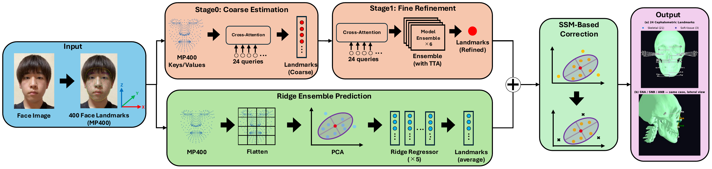

# CT-Free 3D Cephalometric Landmark Estimation

Code and project page for
**“Toward CT-Free 3D Cephalometric Landmark Estimation Using MediaPipe Face Landmarker.”**

* **Project page:** https://cassius-prechs.github.io/ct-free-cephalometry/
* **Paper:** Coming soon.

## Overview

Estimate **24 cephalometric landmarks**, standard cephalometric angles, and skeletal classification (**Class I/II/III**) from a **single RGB photograph** — without CT at inference time.

**Pipeline**

`RGB image → MediaPipe Face Landmarker → 400 landmarks → normalization → landmark estimation → SSM correction → metric coordinates`



Landmark estimation runs two complementary branches — a cross-attention
neural network (Stage0 coarse → Stage1 refinement, both ensembled) and
a PCA-based Ridge regression ensemble — whose predictions are blended
and passed through SSM-based outlier correction.

## Repository

| File                     | Description                                |
| ------------------------ | ------------------------------------------ |
| `infer.py`               | Inference from a photograph                |
| `cephalo.py`             | Model definitions and training             |
| `ensemble.py`            | Stage 1 ensemble evaluation                |
| `generate_landmarks.py`  | Generate MediaPipe landmarks for training  |
| `prepare_artifacts.py`   | Prepare inference artifacts                |
| `run_pipeline.sh`        | Run the complete pipeline                  |

## Setup

```bash
pip install -r requirements.txt
```

Requires **Python 3.10+**.
The MediaPipe Face Landmarker model is downloaded automatically.

## Inference

Trained model checkpoints and clinical training data are not included,
as they are derived from a private patient dataset.

To run inference, prepare your own training data in the expected format and run:

```bash
python prepare_artifacts.py
python infer.py --image photo.jpg
```

or:

```bash
./run_pipeline.sh photo.jpg
```

## Citation

BibTeX will be added after publication.

## License

Code in this repository is released under the [MIT License](LICENSE).
The project page (`docs/`) is adapted from the Nerfies project page
template and remains under [CC BY-SA 4.0](http://creativecommons.org/licenses/by-sa/4.0/),
as noted in its footer.

Trained model checkpoints and the underlying clinical dataset are
**not** included and are not covered by this license, as they are
derived from a private patient dataset.
